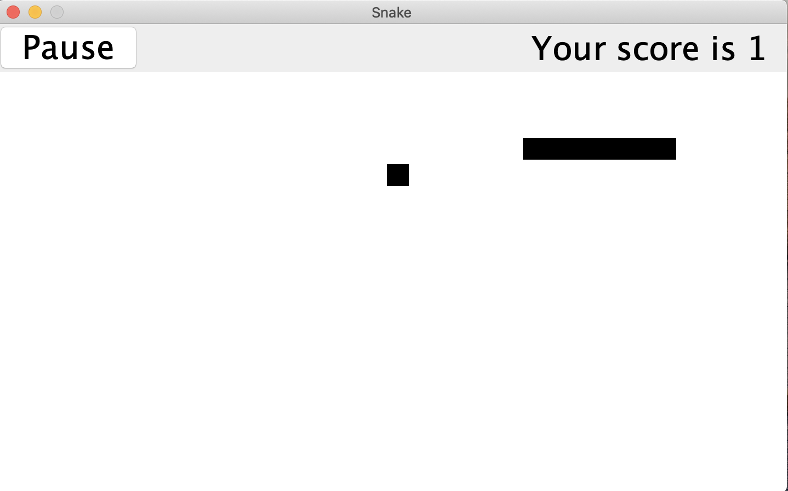
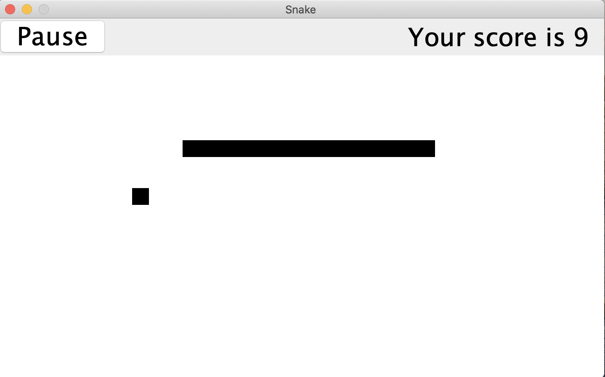
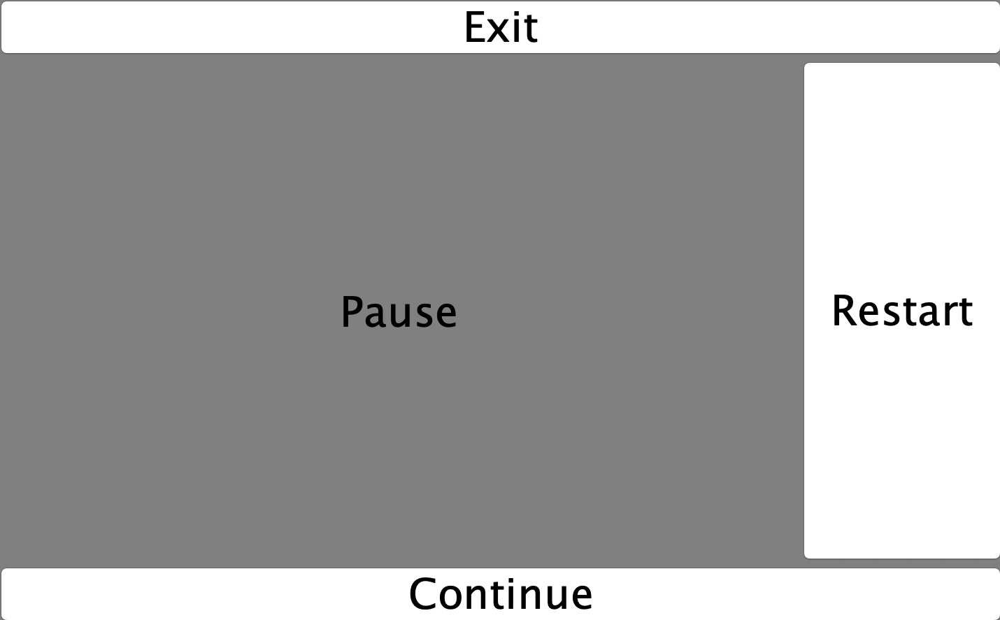
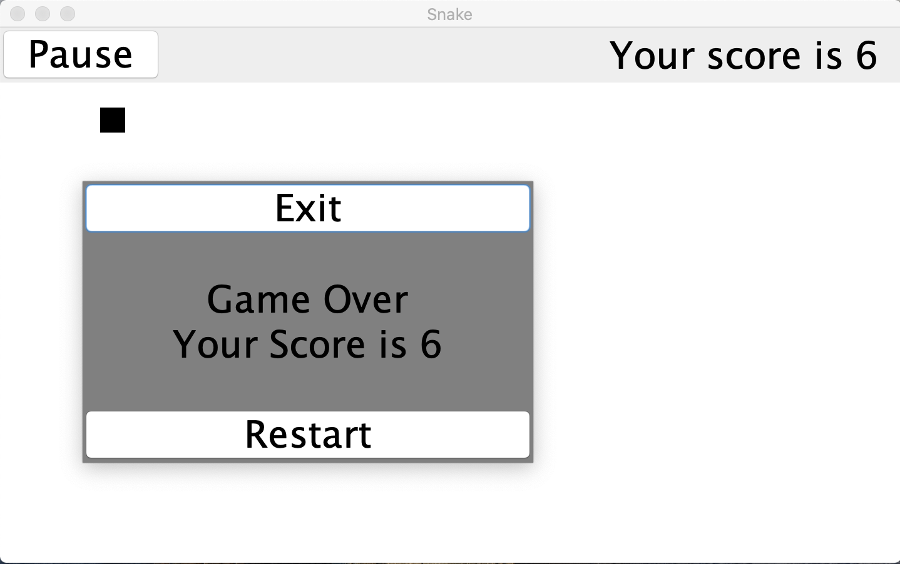

# SwingSnake
This was my first java project when i was 17.  
I have decided that I will not touch the code in the future because it represents a memory of my childhood

Here there are some screenshots:

